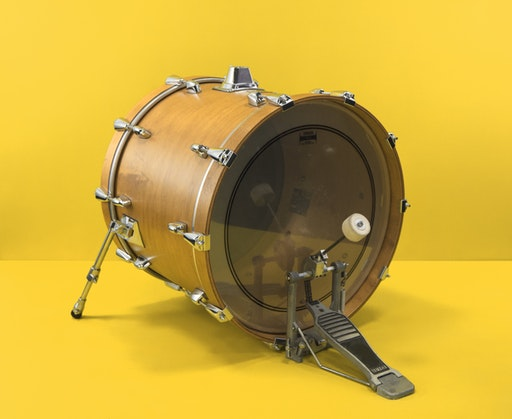
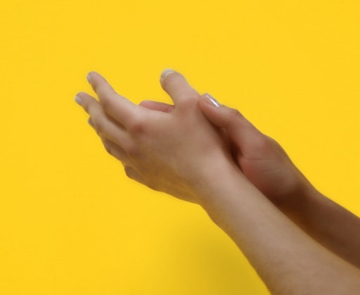
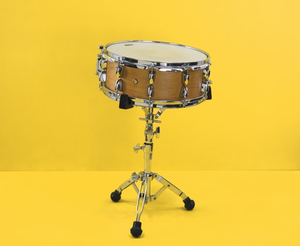
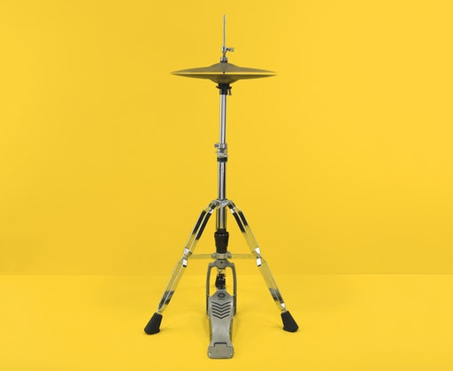

# Ableton

Notes from [learning Ableton](https://learningmusic.ableton.com/).

## Beats

### What are these sounds

Image | Type of Sound | Description
----- | ------------- | -----------
 | Kick | Also called a bass drum, an acoustic kick is struck by a pedal with a beater attached, and is played by the drummer's foot. Electronic versions of this sound are sometimes made to sustain much longer than the relatively short sound produced by a physical drum.
 | Clap | This is the sound of one or more people clapping their hands. Today, electronic, stylized versions of this sound (like the one used here) are much more common than actual recordings of handclaps.
 | Snare | A snare drum is struck with a drum stick, and produces a short, bright sound. A set of wires (called snares) is stretched across a drum head at the bottom of the drum. The vibration of the bottom drum head against the snares produces the drum's characteristic "cracking" tone. Claps, snares, and other "sharp" or "bright" sounds are often used in similar ways in drum patterns.
 | Closed Hat and Open Hat | These are two different sounds created by an instrument called the hihat. Hihats are a pair of small cymbals mounted on a stand. The top cymbal is attached to a rod that is raised and lowered with a foot pedal. Hihats are "closed" when the drummer's foot is down, which presses the cymbals together. They are "open" when the drummer's foot is raised and the cymbals are not touching. On an acoustic drumset, there is a huge range of states in between the open and closed position, and each state creates a different type of sound.

**Tempo**: The speed at which your patterns play back is called the tempo. Tempo is measured in beats per minute or BPM. So if we talk about a piece of music being "at 120 BPM," we mean that there are 120 beats (pulses) every minute.

Typical Genre Tempo Ranges

- Dub: 60-90 bpm
- Hip-hop: 60-100 bpm
- House: 115-130 bpm
- Techno/trance: 120-140 bpm
- Dubstep: 135-145 bpm
- Drum and bass: 160-180 bpm

**Measure**: So far, all of the drum patterns you've looked at loop back to the beginning after four beats. This grouping of four beats is called a bar or measure.

## Notes and Scales

**Pitch**: The relative "highness" or "lowness" of sound.

### Keys and Scales

Most music is in a particular key. If we say that a song is "in the key of C," this means that the pitch C sounds like the most stable “home note” (or tonic) for the song.

Likewise, most songs use notes within a particular scale — a collection of notes in order from low to high.

## Chords

A **chord** is a group of multiple pitches that play at the same time.

The most common chords are **triads**, which are built by adding the third and fifth notes in the scale above a starting note (or root). 

The C major triad is built: 

- C (the root)
- E (the third note above C; often called just "the third")
- G (the fifth note above C; often called just "the fifth")

The C minor triad is built the same way:

- C (the root)
- E♭ (the third note above C; often called just "the third")
- G (the fifth note above C; often called just "the fifth")

https://learningmusic.ableton.com/chords/1-5-6-4.html