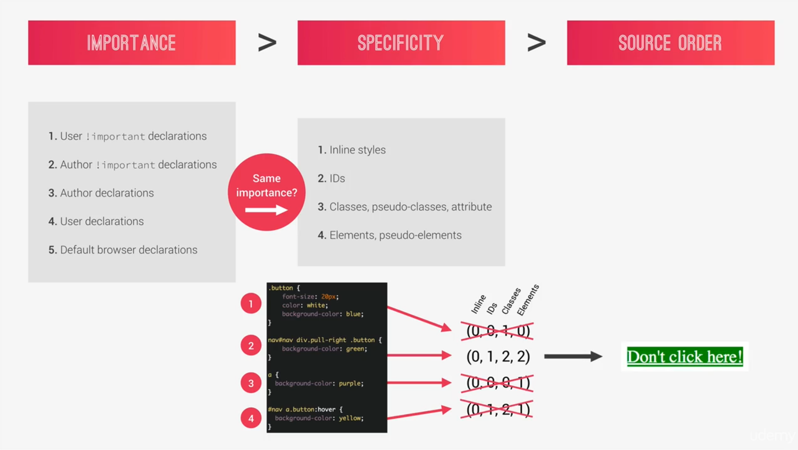
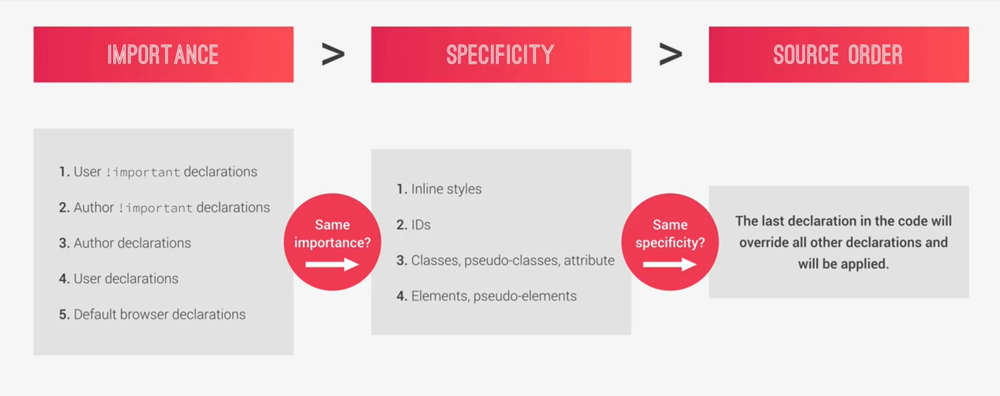

# CSS Cheat Sheet

A fork of [rstacruz](https://github.com/rstacruz/cheatsheets/blob/master/css.md).

## Basics

### Selectors

```css
.class {
  font-weight: bold;
}
```

| Selector          | Description |
| ----------------- | ----------- |
| `div`             | Element     |
| `.class`          | Class       |
| `#id`             | ID          |
| `[disabled]`      | Attribute   |
| `[role="dialog"]` | Attribute   |

### Combinators

| Selector            | Description       |
| ------------------- | ----------------- |
| `.parent .child`    | Descendant        |
| `.parent > .child`  | Direct descendant |
| `.child + .sibling` | Adjacent sibling  |
| `.child ~ .sibling` | Far sibling       |

### Attribute selectors

| Selector          | Description                         |
| ----------------- | ----------------------------------- |
| `[role="dialog"]` | `=` Exact                           |
| `[class~="box"]`  | `~=` Has word                       |
| `[class|="box"]`  | `|=` Exact or prefix (eg, `value-`) |
| `[href$=".doc"]`  | `$=` Ends in                        |
| `[class*="-is-"]` | `*=` Contains                       |

### Pseudo-classes

| Selector             | Description              |
| -------------------- | ------------------------ |
| `:target`            | eg, `h2#foo:target`      |
| `:disabled`          |                          |
| `:focus`             |                          |
| `:active`            |                          |
| `:nth-child(3)`      | 3rd child                |
| `:nth-child(3n+2)`   | 2nd child in groups of 3 |
| `:nth-child(-n+4)`   |                          |
| `:nth-last-child(2)` |                          |
| `:nth-of-type(2)`    |                          |

### Pseudo-class variations

| Selector          |
| ----------------- |
| `:first-of-type`  |
| `:last-of-type`   |
| `:nth-of-type(2)` |
| `:only-of-type`   |
| `:first-child`    |
| `:last-child`     |
| `:nth-child(2)`   |
| `:only-child`     |

## Fonts

### Properties

| Property           | Description                          |
| ------------------ | ------------------------------------ |
| `font-family:`     | `<font>, <fontN>`                    |
| `font-size:`       | `<size>`                             |
| `letter-spacing:`  | `<size>`                             |
| `line-height:`     | `<number>`                           |
| `font-weight:`     | `bold` `normal`                      |
| `font-style:`      | `italic` `normal`                    |
| `text-decoration:` | `underline` `none`                   |
| `text-align:`      | `left` `right` `center` `justify`    |
| `text-transform:`  | `capitalize` `uppercase` `lowercase` |

### Shorthand

|         | style    | weight | size (required) |     | line-height | family            |
| ------- | -------- | ------ | --------------- | --- | ----------- | ----------------- |
| `font:` | `italic` | `400`  | `14px`          | `/` | `1.5`       | `sans-serif`      |
|         | style    | weight | size (required) |     | line-height | family (required) |

### Example

```css
font-family: Arial;
font-size: 12pt;
line-height: 1.5;
letter-spacing: 0.02em;
color: #aa3322;
```

### Case

```css
text-transform: capitalize; /* Hello */
text-transform: uppercase; /* HELLO */
text-transform: lowercase; /* hello */
```

## Background

### Properties

| Property                 | Description                              |
| ------------------------ | ---------------------------------------- |
| `background:`            | _(Shorthand)_                            |
| `background-color:`      | `<color>`                                |
| `background-image:`      | `url(...)`                               |
| `background-position:`   | `left/center/right` `top/center/bottom`  |
| `background-size:`       | `cover` `X Y`                            |
| `background-clip:`       | `border-box` `padding-box` `content-box` |
| `background-repeat:`     | `no-repeat` `repeat-x` `repeat-y`        |
| `background-attachment:` | `scroll` `fixed` `local`                 |

### Shorthand

|               | color  | image         | positionX | positionY |     | size           | repeat      | attachment |
| ------------- | ------ | ------------- | --------- | --------- | --- | -------------- | ----------- | ---------- |
| `background:` | `#ff0` | `url(bg.jpg)` | `left`    | `top`     | `/` | `100px` `auto` | `no-repeat` | `fixed;`   |
| `background:` | `#abc` | `url(bg.png)` | `center`  | `center`  | `/` | `cover`        | `repeat-x`  | `local;`   |
|               | color  | image         | positionX | positionY |     | size           | repeat      | attachment |

### Multiple backgrounds

```css
background: linear-gradient(to bottom, rgba(0, 0, 0, 0.5), rgba(0, 0, 0, 0.5)),
  url('background.jpg') center center / cover, #333;
```

## Animation

### Properties

| Property                     | Value                                                    |
| ---------------------------- | -------------------------------------------------------- |
| `animation:`                 | _(shorthand)_                                            |
| `animation-name:`            | `<name>`                                                 |
| `animation-duration:`        | `<time>ms`                                               |
| `animation-timing-function:` | `ease` `linear` `ease-in` `ease-out` `ease-in-out`       |
| `animation-delay:`           | `<time>ms`                                               |
| `animation-iteration-count:` | `infinite` `<number>`                                    |
| `animation-direction:`       | `normal` `reverse` `alternate` `alternate-reverse`       |
| `animation-fill-mode:`       | `none` `forwards` `backwards` `both` `initial` `inherit` |
| `animation-play-state:`      | `normal` `reverse` `alternate` `alternate-reverse`       |

### Shorthand

|              | name     | duration | timing-function | delay   | count      | direction           | fill-mode | play-state |
| ------------ | -------- | -------- | --------------- | ------- | ---------- | ------------------- | --------- | ---------- |
| `animation:` | `bounce` | `300ms`  | `linear`        | `100ms` | `infinite` | `alternate-reverse` | `both`    | `reverse`  |
|              | name     | duration | timing-function | delay   | count      | direction           | fill-mode | play-state |

### Example

```css
animation: bounce 300ms linear 0s infinite normal;
animation: bounce 300ms linear infinite;
animation: bounce 300ms linear infinite alternate-reverse;
animation: bounce 300ms linear 2s infinite alternate-reverse forwards normal;
```

### Event

```js
.one('webkitAnimationEnd oanimationend msAnimationEnd animationend')
```

## Clipping

`clip-path: polygon(0 0, 100% 0, 100% 75%, 0 100%);`

## Cascading

CSS styles are applied based on three pillars.

`Importance` > `Specificity` > `Source Order`

### Importance

1. User `!important` declarations.
2. Author `!important` declarations.
3. Author declarations.
4. User declarations.
5. Default browser declarations.

### Specificity

1. Inline styles
2. IDs
3. Classes, pseudo-classes, attribute
4. Elements, pseudo-elements

### Source Order

The last declaration in the code will override all other declarations and will be applied.

As an example:

```css
.button {
  background-color: blue;
}

nav#nav div.pull-right .button {
  background-color: green;
}

a {
  background-color: purple;
}

#nav a.button:hover {
  background-color: yellow;
}
```

Selector | Inline | IDs | Classes | Elements | Total
------ | ------ | --- | ------- | -------- | -----
`.button` | 0 | 0 | 1 | 0 | (0, 0, 1, 0)
`nav#nav div.pull-right .button` | 0 | 1 | 2 | 2 | (0, 1, 2, 2)
`a` | 0 | 0 | 0 | 1 | (0, 0, 0, 1)
`#nav a.button:hover` | 0 | 1 | 2 | 1 | (0, 1, 2, 1)




