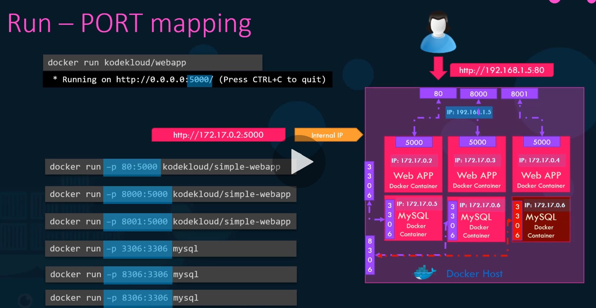
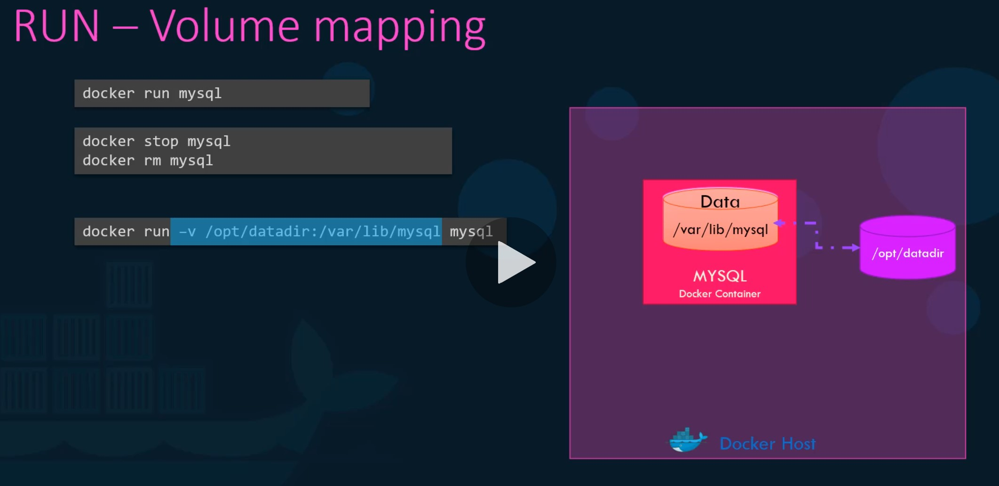

# Docker

Docker is a set of platform as a service products that uses OS-level virtualization to deliver software in packages called containers. Containers are isolated from one another and bundle their own software, libraries and configuration files; they can communicate with each other through well-defined channels.

## Key

Command | Explanation
------- | -----------
`docker` | Reference the Docker client.
`exec` | Run another command.
`-it` | Allow us to provide input to the container. Combination of `-i` (attach to standard in) and `-t` (attach to standard out, nicely displays output).
`<container id>` | ID of the container.
`<command>` | Command to execute.
`-a` | Display all results. Attach this option to the container.

## Run Containers

### docker run

Command | Functionality | Output
------- | ------------- | ------
`docker run <image>` | Start a new container from an image.<br>`docker run` = `docker create` + `docker start` | `docker run nodejs`
`docker run -d <image>`| Start a new container from an image in a detached state. You can continue to use the CLI without seeing its immediate output. | `docker run -d nginx`
`docker run --name <container name> <image>` | Assign the container a name. | `docker run --name webapp nginx`
`docker run -p <host port>:<container port> <image>` | Map the container's ports. | `docker run -p 8080:80 nginx`
`docker run -P <image>` | Map all ports. | `docker run -P nginx`

### docker create

Command | Functionality | Output
------- | ------------- | ------
`docker create <image name>` | Creates a container from an image. | `docker create nginx`

### docker start

Command | Functionality | Output
------- | ------------- | ------
`docker start -a <id>` | Start a container. | `docker start -a 7fb44b5f5e7a7fcd1320d7c01de4e32479679d594ce97416ae6d70d3810a421a`

## Manage Containers

### docker ps

Command | Functionality | Output
------- | ------------- | ------
`docker ps` | List containers. | See table below.
`docker ps --all` or `docker ps -a` | List all containers, even if they've been stopped or exited. | See table below.

```
CONTAINER ID   IMAGE                    COMMAND                  CREATED      STATUS                PORTS                  NAMES
a2506c9c4550   httpd                    "/usr/sbin/init"         4 days ago   Up 4 days             0.0.0.0:8000->80/tcp   httpd
b7ca26bf433b   mysql/mysql-server:5.5   "/entrypoint.sh mysq…"   4 days ago   Up 4 days (healthy)   3306/tcp               cw-mysql
```

### Manage Various

Command | Functionality | Output
------- | ------------- | ------
`docker images` | Display a list of all available images that have been downloaded.
`docker pull <container id>` | Download the container immediately without checking if it exists locally first. | `docker pull nginx`
`docker logs <container id>` | Get logs from a container. | `docker logs e19f6f828ddc9254752388a474e50635db3cf4885cd7c3aa8d414d8ccd104ee6`

### docker exec

Command | Functionality | Output
------- | ------------- | ------
`docker exec <container> <command>` | Execute a command within the image. | `docker exec silly_sammet cat /etc/hosts`
`docker exec -it` | Execute an additional command in a container. |
`docker exec -it 0d2ccab14d7d redis-cli`
`docker exec -it 0d2ccab14d7d sh`

Get shell.

`docker run -it busybox sh`

## Clean Up

### Clean All

Command | Functionality
------- | -------------
`docker system prune` | Cleans up dangling images, containers, volumes, and networks (ie, not associated with a container).
`docker system prune -a` | Additionally remove any stopped containers and all unused images (not just dangling images).

### Clean Containers

Command | Functionality
------- | -------------
`docker stop <container id>` | Stop a container. If it doesn't shut down in 10 seconds it will automatically kill the container.
`docker kill <container id>` | Kill a container. |
`docker rm <container id>` | Removes a container. | `docker rm silly_sammet`
`docker container prune` | Delete stopped containers.

### Clean Images

Command | Functionality
------- | -------------
`docker rmi <image>` | Remove the image permanently. | `docker rmi nginx`
`docker image prune -a` | Delete all the images.

## Images vs. Container

An **image** is a package or template, similar to a VM template. It is used to create 1 or more containers.

**Containers** are running instances of images that are isolated and have their own environments and processes.

## To Categorize

Writing a dockerfile is similar to being given a computer with no OS and being told to install Chrome.

Tag an image
`docker build -t mmaether/redis:latest .`

`copy ./ ./`
Command, path to folder to copy from on *your machine* relative to build context, Place to copy stuff to inside *the container*.

## Port Mapping





## Common Images

### Jenkins

[Jenkins](https://hub.docker.com/_/jenkins/):

`docker run -p 8080:8080 jenkins`, then go to `localhost:8080`

Sometimes after running these commands, you may need to run `docker inspect <container id>` to find the IPAddress.

You may also need to download a different version to get this to work.

`docker run -p 8080:8080 -v /root/my-jenkins-data:/var/jenkins_home -u root jenkins/jenkins:lts`


## Creating my own image

1. INstall OS - Ubuntu
2. Update apt repo
3. Install dependencies using apt
4. Install Python dependencies using pip
5. Copy source code to /opt folder
6. Run the server using "flask" command

`docker build Dockerfile -t mmaether/my-custom-app`

`docker build -t webapp-color .`

`docker push mmaether/my-custom-app` - Add image to Docker Hub repo.

`docker build . -t my-simple-webapp`

`docker push mmaether/my-simple-webapp`: Publish to Docker Hub.