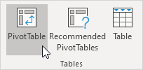
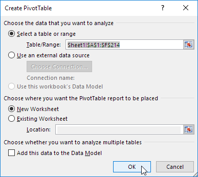
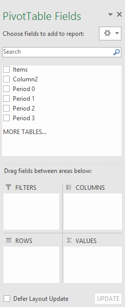
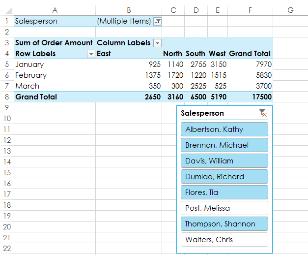
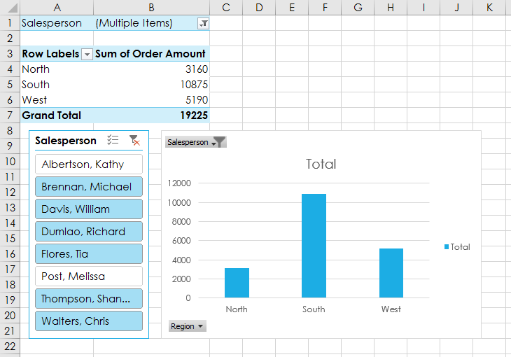
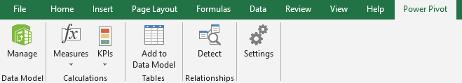
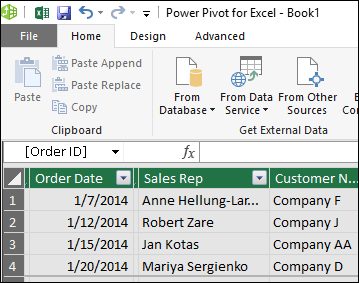
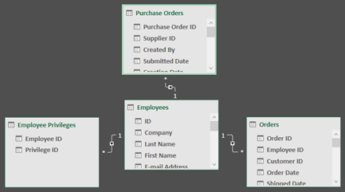

# Excel

A cheatsheet for Excel, because although it's mostly straightforward, most people don't take the time to go in depth to learn all the functionality it has.

## Formulas

Every formula has the following 3 parts:

`= Function Name (Arguments)`

Evaluate Formulas: This is a great tool to debug formulas. It's similar to code debugging where you can step in to a formula and see at each step what a formula returns. This can be found at `Formulas` > `Formula Auditing` > `Evaluate Formulas`.

Function Name | Description | Example
------------- | ----------- | -------
[SUM](https://support.microsoft.com/en-us/office/sum-function-043e1c7d-7726-4e80-8f32-07b23e057f89) | The SUM function adds values. You can add individual values, cell references or ranges or a mix of all three. | `=SUM(A2:A10)` |
[MIN](#) | Returns the smallest number in a set of values. | `=MIN(A2:A6)`

## Shortcuts

For the most up to date shortcuts, refer to Microsoft's [help article](https://support.microsoft.com/en-us/office/keyboard-shortcuts-in-excel-1798d9d5-842a-42b8-9c99-9b7213f0040). This table will list out shortcuts that I find useful.

Functionality | Shortcut
------------- | --------
AutoSum | `Alt + =`
Select the column | `Ctrl + Spacebar`
Select the row | `Shift + Spacebar`
Add new row or column | `Ctrl + Shift + Plus Sign (+)`
Remove a row or column | `Crtl + -`
Highlight all cells above the currently selected cell  | `Ctrl + Shift + Up`
Highlight all cells below the currently selected cell  | `Ctrl + Shift + Down`
Highlight all cells to the right of the currently selected cell  | `Ctrl + Shift + Right`
Highlight all cells to the left of the currently selected cell  | `Ctrl + Shift + Left`

## References

There are two types of cell references: relative and absolute.

1. Relative references change when a formula is copied to another cell.
2. Absolute references remain constant no matter where they are copied.

### Relative References

By default, all cell references are **relative references**. When copied across multiple cells, they change based on the relative position of rows and columns.

For example, if you copy the formula `=A1+B1` from row 1 to row 2, the formula will become `=A2+B2`. Relative references are especially convenient whenever you need to repeat the same calculation across multiple rows or columns.

### Absolute Reference

There may be times when you do not want a cell reference to change when filling cells. Unlike relative references, **absolute references** do not change when copied or filled. You can use an absolute reference to keep a row and/or column constant.

Reference | Description
--------- | -----------
$A$2 | The column and the row do not change when copied.
A$2 | The row does not change when copied.
$A2 | The column does not change when copied.

See Also:

- [GCF Learn Free Relative and Absolute Cell References](https://edu.gcfglobal.org/en/excel2016/relative-and-absolute-cell-references/1/)

## Cell References with Multiple Worksheets

Excel allows you to refer to any cell on any worksheet, which can be especially helpful if you want to reference a specific value from one worksheet to another. To do this, you'll simply need to begin the cell reference with the worksheet name followed by an exclamation point (!).

For example, if you wanted to reference cell `A1` on `Sheet1`, its cell reference would be `Sheet1!A1`.

>Note that if a worksheet name contains a space, you'll need to include single quotation marks (' ') around the name. For example, if you wanted to reference cell `A1` on a worksheet named `July Budget`, its cell reference would be `'July Budget'!A1`.

## Conditional Formatting

1. Highlight the cells.
2. Home > Styles > Conditional Formatting

## Data Visualization

Pie charts are good for a single column or row.

## Custom Sorts

If you have a column with the month spelled out, if you sort it ASC it will make it alphabetical. Excel has a built-in way to support sorting on the actual month values though.

1. Go to Data > Sort & Filter > Sort
2. Under Order click on "Custom List..."
3. Select the custom list.
4. Select the applicable list.

## Subtotal

The Subtotal command allows you to automatically create groups and use common functions like SUM, COUNT, and AVERAGE to help summarize your data. For example, the Subtotal command could help to calculate the cost of office supplies by type from a large inventory order. It will create a hierarchy of groups, known as an outline, to help organize your worksheet.

https://edu.gcfglobal.org/en/excel2016/groups-and-subtotals/1/

Go to Data > Subtotal.

## Duplicates

Select cells. Go to Conditional Formatting, highlight duplicates.

If the list is a table, under the Design tab there is a Remove Duplicates button under Tools.

Or Data > Remove Duplicates

## DSUM

Sum up the total sales, but only where a category is equal to something.

Summing up a set of cells based on criteria. Database Sum.

## DSUBTOTAL

If you have a table of data, it will displays accurately if the list is sorted.

## PivotTable

A PivotTable allows you to extract the significance from a large, detailed data set.

### Insert a PivotTable

1. Click any single cell inside the data set.
2. Go to Insert > Tables > PivotTable.

3. The following dialog box appears. Excel automatically selects the data for you. The default location for a new pivot table is New Worksheet.

### Drag Fields

To add a field to your PivotTable, select the field name checkbox in the PivotTables Fields pane.

To move a field from one area to another, drag the field to the target area.

### Drill Down

Within a PivotTable, if you double click on any cell, it will create a new worksheet with more details about how that cell is calculated.

### Slicers

Slicers make filtering data in PivotTables even easier. Slicers are basically just filters, but they're easier and faster to use, allowing you to instantly pivot your data. If you frequently filter your PivotTables, you may want to consider using slicers instead of filters.

1. Select any cell in the PivotTable.
2. From the Analyze tab, click the **Insert Slicer** command.
3. A dialog box will appear. Select the desired field.
4. The slicer will appear next to the PivotTable.

## PivotCharts

PivotCharts are like regular charts, except they display data from a PivotTable. Just like regular charts, you'll be able to select a chart type, layout, and style that will best represent the data.

1. Select any cell in your PivotTable.
2. From the Insert tab, click the PivotChart command.
3. The Insert Chart dialog box will appear. Select the desired chart type and layout, then click OK.
4. The PivotChart will appear.

See Also:

- [GCF Learn Free Excel - Intro to PivotTables](https://edu.gcfglobal.org/en/excel2016/intro-to-pivottables/1/)
- [Create a PivotTable to analyze worksheet data](https://support.microsoft.com/en-us/office/create-a-pivottable-to-analyze-worksheet-data-a9a84538-bfe9-40a9-a8e9-f99134456576)

## Power Pivot

Power Pivot is a data modeling technology that lets you create data models, establish relationships, and create calculations. With Power Pivot you can work with large data sets, build extensive relationships, and create complex (or simple) calculations, all in a high-performance environment.

### Enabling Power Pivot

Power Pivot must be enabled in Excel to be able to use it.

1. Go to File > Options > Add-Ins.
2. In the Manage box, click COM Add-ins> Go.
3. Check the Microsoft Office Power Pivot box, and then click OK.

### Getting Started with Power Pivot

When the Power Pivot add-on is enabled, the Power Pivot tab in the ribbon is available, as shown in the following image.

From the **Power Pivot** ribbon tab, select **Manage** from the **Data Model** section.

When you select **Manage**, the **Power Pivot window** appears, which is where you can view and manage the data model, add calculations, establish relationships, and see elements of your Power Pivot data model. A **data model** is a collection of tables or other data, often with established relationships among them. The following image shows the **Power Pivot window** with a table displayed.

The **Power Pivot window** can also establish, and graphically represent, relationships between the data included in the model. By selecting the **Diagram view** icon from the bottom right side of the **Power Pivot window**, you can see the existing relationships in the Power Pivot data model. The following image shows the **Power Pivot window** in **Diagram view**.

With a Power Pivot, you can create a PivotTable that uses multiple worksheets.

See Also:

- [Power Pivot Overview and Learning](https://support.microsoft.com/en-us/office/power-pivot-overview-and-learning-f9001958-7901-4caa-ad80-028a6d2432ed)
- [Create a Data Model in Excel](https://support.microsoft.com/en-us/office/create-a-data-model-in-excel-87e7a54c-87dc-488e-9410-5c75dbcb0f7b)
- [Key Performance Indicators in Power Pivot](https://support.microsoft.com/en-us/office/key-performance-indicators-kpis-in-power-pivot-e653edef-8a21-40e4-9ece-83a6c8c306aa)

## Name Manager

You can create variables with the textbox to the left of the formula bar.

## IF() Function

Explain function. Maybe use table above.

`=IF(F5>=Goal,"YES","NO")`

## AND Function

`COUNTIF()`

`SUMIF()`

`VLOOKUP()`: Look up values in another worksheet **vertically**. This is often helpful if you are trying to pull exact values from one worksheet to another.

Examples:

`=VLOOKUP($B3,'Master Emp List'!$A$1:$I$38,2,FALSE)`

`VLOOKUP()` parameters:

- `Lookup_value`: Typically the ID to reference another table.
- `Table_array`: The entire table that you are referencing in another worksheet. The `lookup_value` must be the found in the first column of this table.
- `Col_index_num`: The column number that you want to pull from the other worksheet. This is base 1.
- `Range_lookup`: If you want an exact match use "FALSE", otherwise use "TRUE". Most often we'll use FALSE.

`HLOOKUP()`: Look up values in another worksheet **horizontally**. This follows the same format as `VLOOKUP()`, but is just horizontal.

`INDEX()`: Returns a value at a specific position in a list. You provide the cells to search, then the row and column number (e.g. 4). This pinpoints an exact match in the spreadsheet. This most likely will not be used often on its own.

`MATCH()`: Returns a numeric position of a value. It's the opposite of `INDEX()` where you provide a value, and it tells you which field it's in.

## Errors

Error | Explanation
----- | -----------
`#VALUE!` | "There's something wrong with the way your formula is typed. Or, there's something wrong with the cells you are referencing." The error is very general, and it can be hard to find the exact cause of it. [Troubleshoot](https://support.microsoft.com/en-us/office/how-to-correct-a-value-error-15e1b616-fbf2-4147-9c0b-0a11a20e409e)
`#NUM!` | Excel shows this error when a formula or function contains numeric values that aren’t valid. [Troubleshoot](https://support.microsoft.com/en-us/office/how-to-correct-a-num-error-f5193bfc-4400-43f4-88c4-8e1dcca0428b)
`#N/A` | The `#N/A` error generally indicates that a formula can’t find what it’s been asked to look for. [Troubleshoot](https://support.microsoft.com/en-us/office/how-to-correct-a-n-a-error-a9708411-f82e-4e1b-8a7e-28c28311b993)
`#REF!` | The `#REF!` error shows when a formula refers to a cell that’s not valid. This happens most often when cells that were referenced by formulas get deleted, or pasted over. [Troubleshoot](https://support.microsoft.com/en-us/office/how-to-correct-a-ref-error-822c8e46-e610-4d02-bf29-ec4b8c5ff4be)
`#NAME?` | The top reason why the #NAME? error appears in your formula is because there is a typo in the formula name. [Troubleshoot](https://support.microsoft.com/en-us/office/how-to-correct-a-name-error-b6d54e31-a743-4d7d-9b61-40002a7b4286)
`#####` | Excel might show `#####` in cells when a column isn’t wide enough to show all of the cell contents. Formulas that return dates and times as negative values can also show as #####. [Troubleshoot](https://support.microsoft.com/en-us/office/how-to-correct-a-error-bf801d0a-2a6e-44bd-a70e-0f780ae8f11e)