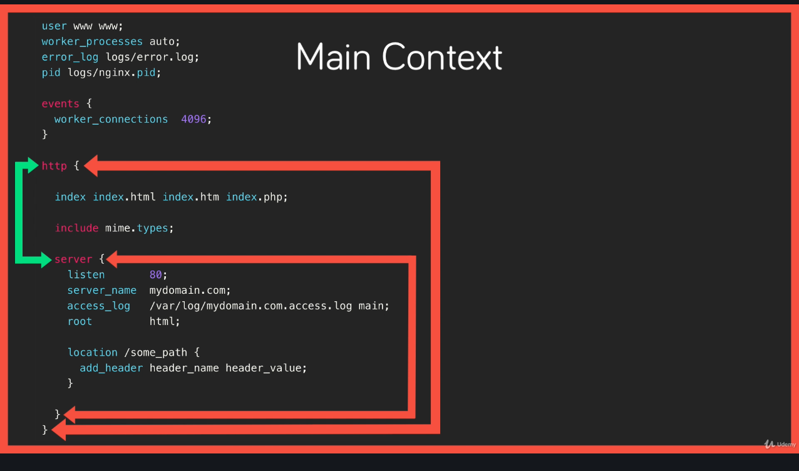

# nginx

## WSL Installation

These installation instructions are specifically for Windows Subsystem for Linux. [Source](https://www.how2shout.com/how-to/install-nginx-php-mysql-wsl-windows-10.html)

1. See WSL cheat sheet for instructions on installing WSL.
2. Open a terminal, enter `wsl` or `bash` to enter the default Linux distribution.
3. Update and upgrade packages: `sudo apt update && sudo apt upgrade`
4. Install nginx: `sudo apt-get install -y nginx`
5. Start nginx: `sudo service nginx start`
6. Test installation, go to: `http:localhost:80`

Command | Description
------- | -----------
`ls -l /etc/nginx` | View nginx installation folder.
`nginx -v` | Quick view of installed nginx version.
`nginx -V` | Detailed view of nginx version.
`nginx` | Starts nginx
`ps aux | grep nginx` | View to see if nginx is running
`nginx -h` | Displays flags you can run.
`nginx -s` | Stands for signal. Can be used to stop nginx, e.g. `nginx -s stop`

## Building nginx from Source

1. Go to the [nginx download page](http://nginx.org/).
2. There are a few links:
   1. CHANGES: the changelog
   2. nginx-x.xx.x: The source code of nginx itself
   3. nginx/Windows-x.xx.x: The Windows binary of nginx.
   4. pgp: Stands for Pretty Good Privacy. It provides cryptographic privacy and authentication for data communication on the downloads.
3. Copy the link location of the source code.
4. Head back to the terminal and download the source code. `wget http://nginx.org/download/nginx-1.19.1.tar.gz`
5. Extract it. `tar -zxvf nginx-1.19.1.tar.gz`
6. Move into the folder. `cd nginx-1.19.1.tar.gz`
7. Configure the source code. Check to see if it can compile. `./configure`
8. It may say a compiler is not installed. One can be installed by running `apt-get install build-essential`
9. Then rerun the configuration. `./configure`
10. You may see `error: the HTTP rewrite module requires the PCRE library.` You can use this command to download missing dependencies. `apt-get install libpcre3 libpcre3-dev zlib1g zlib1g-dev libssl-dev`
11. Run `./configure` again. It should work.

Then we can make custom configuration changes. 

To view all possible configurations, run `./configure --help`. We can view more in the [nginx documentation](http://nginx.org/en/docs/configure.html) page.

You can run this command to customize your nginx installation.

`./configure --sbin-path=/usr/bin/nginx --conf-path=/etc/nginx/nginx.conf --error-log-path=/var/log/nginx/error.log --http-log-path=/var/log/nginx/access.log --with-pcre --pid-path=/var/run/nginx.pid --with-http_ssl_module`

Flag | Description
---- | -----------
`--sbin` | Location of the nginx executable to start and stop nginx.
`--conf-path` | The path of the nginx configuration files. 
`--error-log-path` | The path of the nginx log files.
`--http-log-path` | Logs of the nginx server.
`--with-pcre` | Telling nginx to use the system's pcre library for regular expressions.
`--pid` | Process ID path. What we'll need to know when configuring the nginx system configuration.

Then run `make` to compile this customization. 

Install the compiled source: `make install`

## Adding a Service

Configuring a system service through systemd.

Allows us to standardize starting, stopping, restarting, reloading (configuration), and start on boot.

To enable systemd, we need to add a small script. This can be copied from the nginx website.

1. Go to the [nginx website](https://www.nginx.com/resources/wiki/start/topics/examples/initscripts/).
2. Under Systemd click on its [link](https://www.nginx.com/resources/wiki/start/topics/examples/systemd/).

Save this file as `/lib/systemd/system/nginx.service`. 

So run `touch /lib/systemd/system/nginx.service` and paste the code.

```
[Unit]
Description=The NGINX HTTP and reverse proxy server
After=syslog.target network-online.target remote-fs.target nss-lookup.target
Wants=network-online.target

[Service]
Type=forking
PIDFile=/run/nginx.pid
ExecStartPre=/usr/sbin/nginx -t
ExecStart=/usr/sbin/nginx
ExecReload=/usr/sbin/nginx -s reload
ExecStop=/bin/kill -s QUIT $MAINPID
PrivateTmp=true

[Install]
WantedBy=multi-user.target
```

## Configuration

### Terms

- Directive: Specific configuration options that gets set in the configuration files. Consists of a name and value, e.g. `server_name mydomain.com;`
- Context: Sections within the configuration. Directives can be set within the context. Contexts can be nested.

