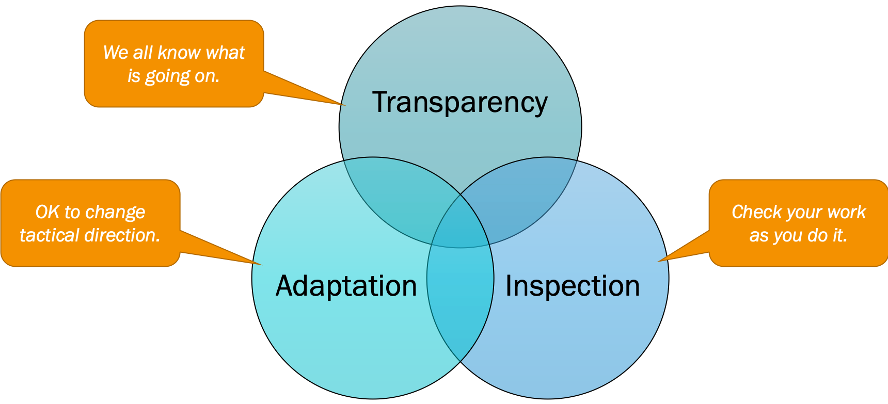
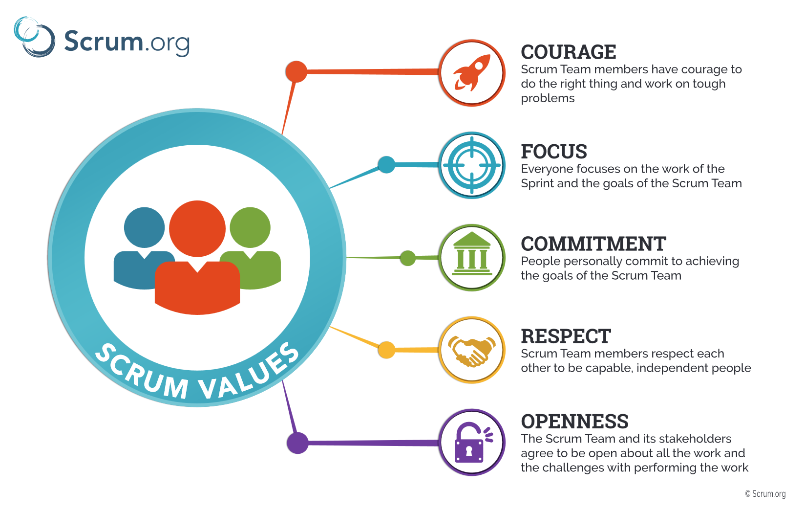

# Product Owner

This document outlines notes taken while following the Scrum.org [Product Owner Learning Path](https://www.scrum.org/pathway/product-owner-learning-path/understanding-and-applying-the-scrum-framework/empiricism) and from the Udemy course [Scrum Product Owner Certification Prep](https://www.udemy.com/course/scrum-product-owner-certification-prep-mock-exam-questions/).

## Scrum Artifacts

An artifact is something that is created by the ones using the Scrum framework.

Artifacts represent work and value, and provide transparency and opportunities for inspection and adaptation.

1. Product Backlog
2. Sprint Backlog
3. Increment

## Product Backlog

A list of requirements that contains new features, improvements, fixes, or other changes that need to be done on the product. As long as the product exists, so will its backlog.

Product Backlog Items contain:

- Description
- Order
- Estimate
- Value: Adding story points
- Test description: Helps test if the work performed is completed. Also known as Acceptance Criteria.

The Product Owner is solely responsible of the Product Backlog. He needs to work with the development team closely.

1 Product = 1 Product Owner = 1 Product Backlog

A product backlog is never complete and will always grow and change due to any numerous factors (how the market grows, more requirements, etc.).

### User Stories

**User Stories** are short descriptions of a feature explained from the **perspective of the user.**

User stories are optional in Scrum. They are by no means mandatory.

> As a *kind of user*, I want *some objective* so that *some reason*.

A test description / acceptance criteria will help understand what exactly is expected with this item.

### Backlog Refinement

- It can occur at any time as the Scurm team deems fit.
- It should not occupy more than 10% of the capacity of the Development team.
- The goal of this meeting is to have enough product backlog items at the top of the backlog ready for the next sprint planning.
- The Product Owner and the Development Team ensure the items are small enough to fit into one sprint.
- The top of the list is more refined than those at the bottom.
- The backlog can be changed at any time by the Product Owner.
- The development team is responsible for all estimates and has the final say.

**Backlog Grooming** is an older term that has been deprecated since 2003. The term Refinement is preferred. We say that the Product Backlog is refined rather than groomed.

Story Points are often represented as the fibonnaci sequence. 0, 1, 2, 3, 5, 8, 13, 20, 40, and 100.

**Planning Poker**: The development team has a set of cards similar to poker cards with the Fibonnaci sequence. They will show their cards at the same time to estimate a user story.

If there is a disagreement, typically the lowest number and the highest number discuss their reasoning.

### Sprint Backlog

The Product Owner explains which items will achieve the sprint goal, but the development team will determine who.

The development team owns the sprint backlog.

**Increment**: All the Product Backlog items completed during a sprint + the value of all increments from all previous sprints.

The development team creates the definition of done.

## Scrum Events

**Sprint**:

- Container for all events.
- Has a time-box of one month or less.
- Most sprints are only two or three weeks long.

**Sprint Goal**: Objective that should be reached within the timeline. During the sprint, no changes should be made that would endanger the Sprint goal.

The new sprint starts immediately after the current sprint ends.

**Cancelling**: Very rare occurrance. A Sprint can be cancelled if the Sprint Goal becomes obsolete (i.e. market changes). Only the Product Owner has the authority to cancel a sprint.

If cancelled, product backlog items will be re-estimated and put back in the Product Backlog.

**Sprint Planning**:

- Right after conclusion of previous sprint.
- Time boxed to 8 hours for 1 month sprint.
- For smaller sprints it should be shorter.
- Determine what can be delivered, and how to make it happen with a plan.
- Two parts: PO presents objective that a sprint should achieve and a product backlog items, that if completed, would complete the objective.
- 1. What can be done in the Sprint. This is forcasted by the development team
- 2. How to implement the work.

Inputs for the sprint planning meeting:

- Latest product increment
- Product Backlog
- Projected capacity: availability of the developers, holidays, etc.
- Past performance

Also Definition of Done for sprint planning.

**Daily Scrum**:

- What did I do yesterday?
- What will I do today?
- Do I see any impediments?

The development team should begin the Daily Scrum. The Product Owner should not be present, it is meant for the developers.

**Sprint review**:

Held at the end of the sprint to review the increment. Product Owner holds this meeting and invites stakeholders to the event. Maximum of 4 hours for 1 month's sprint.

Informal meeting. Demonstration fo the increment and to encourage collaboration on what happens next.

Product Owner explains items that have been done and have not been done. He maximizes the value of the product.

The development team demonstrates the work that's been accomplished and to gather feedback. Often the stakeholders can try the product with their hands.

The development team discusses what went well and what didn't go well.

The product owner discusses the backlog and explains when the next release may occur. Discuss strategic planning with stakeholders. Stakeholders can ask questions and ask to revise the product.

Items that are not done: they will not be demonstrated. They will not be part of the product increment as they do not follow the definition of done. Put back into the Product Backlog and the Product Owner determines what happens with it.

**Sprint retro**:

Inspect and adapt the process. Internal scrum team event with no external team members. 1 month sprint, the maximum duration is 3 hours.

Maximum of 3 hours for a 1 month sprint.

- How was the sprint in regard to people, relationship, processes and tools.
- What went well?
- What didn't go well?
- How can we improve?

It's recommended to use an ice breaker, such as funretrospective.com

## Roles

The primary responsibility of the Product Owner is to maximize the value. It is 1 person.

The development team is self-organzing. No one else tells them what tools to use, etc. The team as a whole should be cross-functional. Responsible as a whole. No official titles for these individuals. You want between 3 and 9 development members. Product Owner and Scrum Masters are not included in this count.

## Agile

[Manifesto for Agile Software Development](https://agilemanifesto.org/)

>We are uncovering better ways of developing software by doing it and helping others do it. Through this work we have come to value:
>
>Individuals and interactions over processes and tools
>Working software over comprehensive documentation
>Customer collaboration over contract negotiation
>Responding to change over following a plan
>
>That is, while there is value in the items on the right, we value the items on the left more.

[Principles Behind the Agile Manifesto](https://agilemanifesto.org/principles.html).

>We follow these principles:
>
>Our highest priority is to satisfy the customer through early and continuous delivery of valuable software.
>
>Welcome changing requirements, even late in development. Agile processes harness change for the customer's competitive advantage.
>
>Deliver working software frequently, from a couple of weeks to a couple of months, with a preference to the shorter timescale.
>
>Business people and developers must work together daily throughout the project.
>
>Build projects around motivated individuals. Give them the environment and support they need, and trust them to get the job done.
>
>The most efficient and effective method of conveying information to and within a development team is face-to-face conversation.
>
>Working software is the primary measure of progress.
>
>Agile processes promote sustainable development. The sponsors, developers, and users should be able to maintain a constant pace indefinitely.
>
>Continuous attention to technical excellence and good design enhances agility.
>
>Simplicity--the art of maximizing the amount of work not done--is essential.
>
>The best architectures, requirements, and designs emerge from self-organizing teams.
>
>At regular intervals, the team reflects on how to become more effective, then tunes and adjusts its behavior accordingly.

## Scrum

Scrum is a framework. It is not a propcess, technique, or definitive method.

Scrum is:

- Lightweight
- Simple to understand
- Difficult to master

Scrum is founded on empiricism. Empiricism asserts that knowledge comes from **experience**.

Three pillars of the empirical process control:

- Transparency: We all know what's going on.
- Inspection: Check your work as you do it. Scrum users must regularly inspect Scrum artifacts (product backlog, sprint backlog, the increment) and progress toward a Sprint Goal to detect undesirable results.
- Adaptation: OK to change tactical direction.

Scrum prescribes four formal events for inspection and adaptation:

- Sprint Planning
- Daily Scrum
- Sprint Review
- Sprint Retrospective

The Scrum Teams should be built on the following values:

- Commitment
- Courage
- Focus
- Openness
- Respect

=> TRUST

## Evidence-Based Management Guide

Masures the impact made to the Product have delivered. 

Source: https://www.scrum.org/resources/evidence-based-management-guide

### Current Value (CV)

Reveals the value that the Product delivers to customers right now.

Example Key Value Measures (KVMs)

- Customer Usage Index - measures which features of the product are actually used and which are not
- Customer Satisfaction - a quantifiable way to understanding if customers are happy with the Product. For example a monthly survey can help keep track of this metric

### Time-to-Market (T2M)

Some industries tend to move at a quick fast pace, so it is essential to know the ability of the organization to deliver new features, services, or products in a timely manner.

So the focus here is to minimize the Time-to-Market. Here are a few metrics that can help an organization manage the Time-to-Market.

- **Build and integration frequency and Release Frequency** - if work is only tested and integrate once a month, the time-to-market for any feature will be at least one month. In software development (and not only) many development teams have adopted a practice called continuous deployment, which allows them to continuously integrate the work if the work of other teams, to test it, and to release it to end-users, sometimes up to 50 times per day.

### Ability to Innovate (A2I)

The ability to innovate tries to measure the capability of the organization to come up with new and innovative solutions to customer problems.

The focus of this Key Value Area is to look at what is preventing the Development Organization to do this. Typical causes for this can include technical debt that is out of control, an outdated application architecture but also a lack of skills or quality standards within the organization.

Let's take one example Key Value Measure

- **Defect trends** - defects or commonly called bugs in software development, are things that don't work as intended. If severe enough, defects can prevent the end-user from performing a specific task and reduces the value of the product.

### Unrealized Value (UV)

Reveals the potential value that the Product could deliver to customers in the future.

The goal is to identify the unrealized value and to convert it to current value.

A Product with a low current value and a high Unrealized Value may indicate a great market potential.

An example KVM is:

- The **Market Share** of the Product, which indicates how much of a specific market is controlled by the Product.

---------------------------------

## Understanding and Applying the Scrum Framework

### Empiricism

Empiricism means working in a fact-based, experience-based, and evidence-based manner. Scrum implements an empirical process where progress is based on observations of reality, not fictitious plans. Scrum also places great emphasis on mind-set and cultural shift to achieve business and organizational Agility.

The three pillars of empiricism are:

1. Transparency: We all know what's going on.
2. Inspection: Check your work as you do it.
3. Adaptation: OK to change tactical direction.

Source: https://www.scrum.org/resources/blog/three-pillars-empiricism-scrum

An example of empiricism is a **thermostat**.

- Transparency: You can see the desired temperature and the current temperature.
- Inspection: You are able to constantly check the thermostat to ensure it's accurate.
- Adaptation: The termostat will continuously change its temperature to ensure it's accurate.

## Scrum Values

- Courage: Scrum Team members have course to do the right thing and work on tough problems.
- Focus: Everyone focuses on the work of the Sprint and the goals of the Scrum Team.
- Committment: People personally commit to echieving the goals of the Scrum Team.
- Respect: Scrum Team members respect each other to be capable, independent people.
- Openness: The Scrum Team and its stakeholders agree to be open about all the work and the challenges with performing the work.

Source: https://scrumorg-website-prod.s3.amazonaws.com/drupal/2018-05/ScrumValues-Tabloid.pdf

## Scrum Roles

Scrum standards recommends only [one product owner](https://www.scrum.org/resources/blog/why-you-need-only-one-product-owner). Downsides of having multiple POs:

- Having many POs encourages micromanagement of teams.
- Many POs requires coordination and alignment.
- Many POs bring unclear responsibility and ownership.

## What is a Sprint Review

This [Sprint Review](https://www.scrum.org/resources/what-sprint-review) video explains it very thoroughly, especially about misconceptions and how it should actually be handled.

https://www.scrum.org/resources/evidence-based-management

### Sprint Goal

    The Sprint Goal is an objective set for the Sprint that can be met through the implementation of a Product Backlog. It provides guidance to the Development Team on why it is building the Increment. It is created during the Sprint Planning meeting. The Sprint Goal gives the Development Team some flexibility regarding the functionality implemented within the Sprint. The selected Product Backlog items deliver one coherent function, which can be the Sprint Goal. The Sprint Goal can be any other coherence that causes the Development Team to work together rather than on separate initiatives.

Challenges with the sprint goal:

1. There is no Sprint goal
2. The work is the Sprint goal
3. There is no room for anything else
4. There is no focus on the Sprint goal
5. The goal is not a goal

Examples:

- Implement the functionality for user registration.
- Launch a partnership program for acquiring new clients and increasing the company's earnings.

Source: [Scrum Trenches - Sprint Goals](https://www.scrum.org/resources/blog/scrum-trenches-sprint-goal)

What are the Scrum Artifacts?
Product Backlog
Sprint Backlog
Increment

Value Driven Development

What factors should be considered by the Product Owner in the release decision (select four)?
The amount of work remaining toward the Sprint Goal
x The costs and benefits of the upgrade
Approval of the Key Stakeholders
x The risk that the product’s value can get out of line with the marketplace
x The customers that will be constrained by the new release
x Can customers actually absorb the new release?
Does the Increment meet the Definition of “Done”?

What is the Sprint Backlog?
The Product Backlog items selected for this Sprint plus the plan for delivering them

Select the five Scrum Values.
Commitment
Openness
Focus
Respect
Courage

What does Cone of Uncertainty show?

Product Owner 100%
Scrum Artifacts 58.33%
Scrum Events 70.59%
Scrum Team 75%
Scrum Theory 56%

Take 2:

Product Owner 100%
Scrum Artifacts 87.5%
Scrum Events 82.35%
Scrum Team 75%
Scrum Theory 76%

The time-box for the Sprint Planning meeting is?
8 hours for a monthly Sprint. For shorter Sprints it is usually shorter. 

What are the time-boxes for the Sprint Review and the Sprint Retrospective?
4 and 3 hours respectively 

Five Scrum Values

What are the Scrum Artifacts? Select all applicable items.

Product Backlog Refinement timebox (10%?)

How long should the Sprint Planning be?
Not more than 8 hours 

Select the two focus areas that are not considered in executing Value Driven Development by the Product Owner.
Coach of the Development Team in self-organization and cross-functionality 
Remover of impediments to the Development Team’s progress 

Definition of Done
Non-Functional Specifications
How should the Development Team make non-functional specifications transparent towards the Product Owner?

Scrum Team Values:
- Commitment
- Courage
- Focus
- Openness
- Respect

Timeboxed events for 1 month:

- The Sprint: The heart of Scrum is a Sprint, a time-box of one month or less 
- Sprint Planning is time-boxed to a maximum of eight hours for a one-month Sprint
- The Daily Scrum is a 15-minute time-boxed event 
- Sprint Review: This is at most a four-hour meeting for one-month Sprints
- Sprin Retro: This is at most a three-hour meeting for one-month Sprints

## Resources

- [The Scrum Guide PDF](https://www.scrumguides.org/docs/scrumguide/v2017/2017-Scrum-Guide-US.pdf)
- [The Scrum Guide Online](https://www.scrumguides.org/scrum-guide.html)
- [Scrum Glossary](https://www.scrum.org/resources/scrum-glossary)
- [Evidence-Based Management Guide](https://www.scrum.org/resources/evidence-based-management-guide)
- [Myth 2: The Sprint Backlog can’t change during the Sprint](https://www.scrum.org/resources/blog/myth-2-sprint-backlog-cant-change-during-sprint)
- [Scrum Trenches - Sprint Goals](https://www.scrum.org/resources/blog/scrum-trenches-sprint-goal)
- [Nexus Guide](https://www.scrum.org/resources/online-nexus-guide)
- [PSPO 1 Preparation Quiz](https://mlapshin.com/index.php/scrum-quizzes/po-real-mode/)