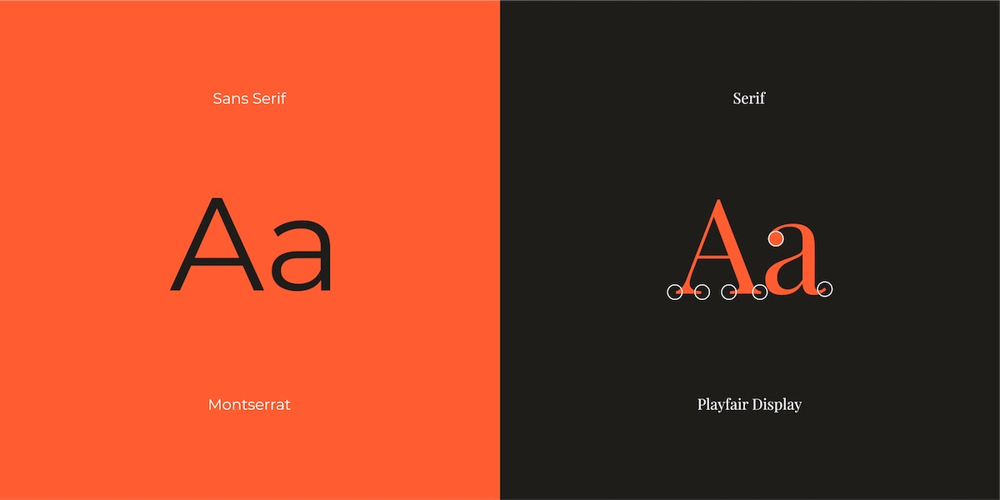

# Web Design Cheat Sheet

## Typography

* Use a font-size between 15px and 25px.
* Use (really) big font sizes for headlines, i.e. 60px, 32px, 90%. Lower font-weight helps.
* Use line spacing between 120% and 150%.
* Have 45 to 90 characters per line.
* Use good fonts.



[Source](https://www.canva.com/learn/serif-vs-sans-serif-fonts/)

Sans-serif:

* More neutral
* Clean
* Simple
* Modern websites

Recommended Google Fonts: `Open Sans`, `Lato`, `Raleway`, `Monsterrat`, `PT Sans`.

Serif:

* Traditional purposes
* Storytelling
* Long reading

Recommended Google Fonts: `Cardo`, `Merriweather`, `PT Serif`.

## Colors

* Use only one base color.
* Use a tool if you want to use more colors.
* Use color to draw attention.
* Limit your use of black in your design.
* Choose colors wisely.

Color Meaning:

* **Red** is a great color to use when power, passion, strength and excitement want to be transmitted. Brighter tones are more energetic and darker shades are more powerful and elegant.
* **Orange** draws attention without being as overpowering as red. It means cheerfulness and creativity. Orange can be associated with friendliness, confidence, and courage.
* **Yellow** is energetic and gives the feeling of happiness and liveliness. Also, it associates with curiosity, intelligence, brightness, etc.
* **Green** is the color of harmony, nature, life and health. Also, it is often associated with money. In design, green can have a balancing and harmonizing effect.
* **Blue** means patience, peace, trustworthiness, and stability. It is one of the most beloved colors, especially by men. It is associated with professionalism, trust and honor. That's actually why the biggest social networks use blue.
* **Purple** is traditionally associated with power, nobility and wealth. In your design, purple can give a sense of wisdom, royalty, nobility, luxury, and mystery.
* **Pink** expresses romance, passivity, care, peace, affection, etc.
* **Brown** is the color of relaxation and confidence. Brown means earthiness, nature, durability, comfort, and reliability.

Color Resources:

* [Flat UI Colors](http://flatuicolors.com/)
* [Material Palette](http://www.materialpalette.com/)
* [Color Hunt](https://colorhunt.co/)
* [UI Gradients](https://uigradients.com/)
* [Adobe Color](https://color.adobe.com/)

## Images

* Put text directly on the image.
* Overlay the image with color (i.e. black/grey, gradients).
* Put your text in a box.
* Blur the image.
* Use a floor fade. Have the background be darker where text is.

Overlay

```css
.darken {
  background-image: linear-gradient(rgba(0, 0, 0, 0.5), rgba(0, 0, 0, 0.5)), url(YOUR IMAGE HERE);
}
```

Text in a box

```css
.text-box {
  background-color: rgba(0, 0, 0, 0.5);
  color: #fff;
  display: inline;
  padding: 10px;
}
```

Floor fade

```css
.floor-fade {
  background: linear-gradient(to bottom, rgba(0, 0, 0, 0), rgba(0, 0, 0, 0.6) ), url(YOUR IMAGE HERE);
}
```

## Icons

* Use icons to list features / steps.
* Use icons for actions and links.
  * Icons should be recognizable.
  * Label your icons.
* Icons should not take a center stage.
* Use icons fonts or SVGs where possible. Do not use static images.

## Spacing and Layout

* Use whitespace.
  * Put whitespace between your elements.
  * Put whitespace between your groups of elements.
  * Put whitespace between your website's sections.
  * But don't exaggerate.
* Define hierarychy. Whitespace describes invisible relationships between the elements of your website.
  * Define where you want your audience to look first.
  * Establish a flow that corresponds to your content's message.
  * Use whitespace to build that flow.
